# Mangrove Canopy Height and Above-Ground Biomass Estimation (GEE)


A reproducible **two-stage Random Forest regression** workflow for wall-to-wall mapping of mangrove **canopy height (CH)** and **above-ground biomass density (AGBD)** along the **West Kalimantan Mangrove Coast**, implemented entirely in **Google Earth Engine**. Stage 1 estimates canopy height from GEDI L2A RH98 footprints as training labels; Stage 2 uses the resulting wall-to-wall CH map as an additional predictor for AGBD estimation against GEDI L4A ground truth. Mangrove extent is constrained using the **Global Mangrove Watch v3 (2020)** mask. The script ships with an interactive dual-sidebar UI (layer toggles, gradient legends, opacity sliders, pixel inspector, and per-model performance panels).

<p align="center">
  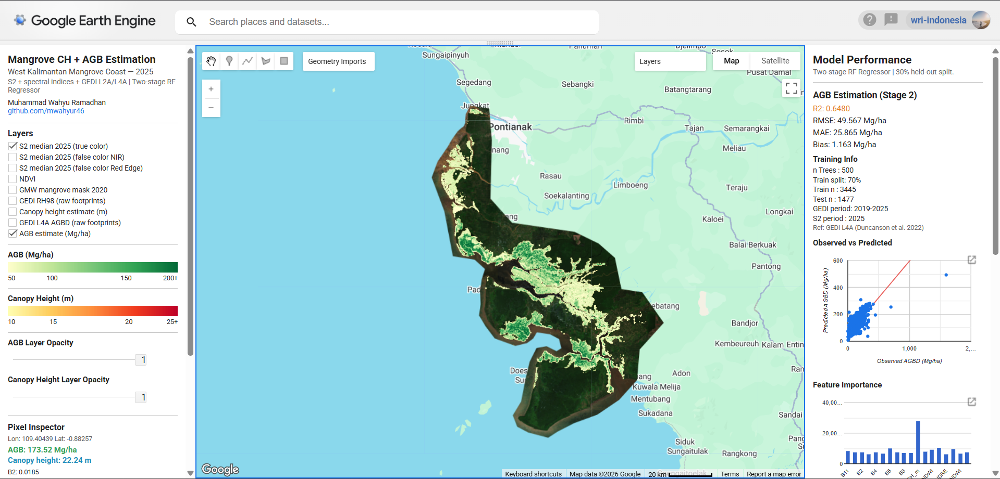
</p>

---

## Background

Accurate estimation of mangrove biomass and canopy structure is critical for carbon accounting, ecosystem monitoring, and conservation planning. Conventional field-based approaches are limited in spatial coverage, while single-stage spectral regression from optical imagery often underperforms due to the spectral saturation of dense canopy. This repository implements a two-stage approach in which GEDI spaceborne lidar provides wall-to-wall canopy height as a structural intermediate, substantially improving AGBD prediction accuracy over a direct spectral-to-biomass model.

GEDI L4A AGBD values are derived from the model of Duncanson et al. (2022), which converts GEDI RH metrics to above-ground biomass density in Mg/ha. The Global Mangrove Watch v3 extent layer (Bunting et al. 2022) constrains all analysis to confirmed mangrove pixels.

---

## Repository Structure

```
mangrove-canopy-height-agb-estimation-gee/
|-- agb_canopy_height_west_kalimantan.js   # two-stage CH + AGB estimation
|-- images/
|   |-- map_overview.png
|   |-- agb_map.png
|   |-- canopy_height_map.png
|   |-- false_color_mangrove.png
|   |-- gedi_footprints.png
|   |-- right_panel_agb.png
|   |-- right_panel_ch.png
|   |-- pixel_inspector.png
|   |-- scatterplot_agb.png
|   |-- scatterplot_ch.png
|   |-- fimportance_agb.png
|   |-- fimportance_ch.png
|-- README.md
|-- LICENSE
```

---

## Method

The workflow runs entirely server-side in Google Earth Engine and produces two wall-to-wall raster outputs masked to GMW mangrove extent.

| Step | Description |
|------|-------------|
| 1 | Build 2025 annual **median composite** from Sentinel-2 SR Harmonized (SCL-based cloud mask). |
| 2 | Derive **7 spectral indices** (NDVI, NDWI, MNDWI, NDMI, NDRE, SAVI, EVI). |
| 3 | Apply **Global Mangrove Watch v3 (2020)** as binary spatial mask. |
| 4 | Filter **GEDI L2A** (2019-2025, quality_flag == 1); compute mean RH98 per pixel as CH target. |
| 5 | Train **Stage 1 RF regressor** (500 trees, 70/30 split) to predict RH98 from S2 feature stack. |
| 6 | Apply Stage 1 model to produce **wall-to-wall canopy height map**. |
| 7 | Filter **GEDI L4A** (2019-2025, l4_quality_flag > 0.3); compute mean AGBD per pixel. |
| 8 | Train **Stage 2 RF regressor** on S2 feature stack + CH map as additional predictor. |
| 9 | Apply Stage 2 model to produce **wall-to-wall AGB map**. |
| 10 | Evaluate both models with R2, RMSE, MAE, and Bias on held-out test set. |
| 11 | Export rasters and test prediction tables to Google Drive. |

### Two-Stage Architecture

```
S2 bands + indices
        |
   [Stage 1 RF]  <-- GEDI L2A RH98 (training labels)
        |
  CH map (wall-to-wall)
        |
S2 bands + indices + CH_m
        |
   [Stage 2 RF]  <-- GEDI L4A AGBD (training labels)
        |
  AGB map (wall-to-wall)
```

### Spectral Indices

| Index | Formula | Purpose |
|-------|---------|---------|
| NDVI  | (B8 - B4) / (B8 + B4) | Vegetation vigor |
| NDWI  | (B3 - B8) / (B3 + B8) | Open water |
| MNDWI | (B3 - B11) / (B3 + B11) | Water vs built-up separation |
| NDMI  | (B8 - B11) / (B8 + B11) | Canopy moisture |
| NDRE  | (B8A - B5) / (B8A + B5) | Canopy chlorophyll and nitrogen |
| SAVI  | 1.5 * (B8 - B4) / (B8 + B4 + 0.5) | Vegetation with soil adjustment |
| EVI   | 2.5 * (B8 - B4) / (B8 + 6*B4 - 7.5*B2 + 1) | Dense canopy (reduces NDVI saturation) |

### GEDI Products

| Product | Band | Use |
|---------|------|-----|
| LARSE/GEDI/GEDI02_A_002_MONTHLY | rh98 | Canopy height training labels (Stage 1) |
| LARSE/GEDI/GEDI04_A_002_MONTHLY | agbd | AGBD training labels (Stage 2) |

---

## How to Run

1. Open the script in the [Google Earth Engine Code Editor](https://code.earthengine.google.com).
2. Copy `agb_canopy_height_west_kalimantan.js` into a new GEE script.
3. Import the following asset through the **Imports** panel:
   - `aoi` -- `ee.Geometry` covering the target mangrove area
   - or you can draw the aoi by 'Draw a Shape' and/or 'Draw a Rectangle' tools
4. Click **Run**. Stage 1 and Stage 2 models train sequentially. The interactive sidebars populate after server-side computation completes (typically 30 to 60 seconds depending on AOI size).
5. Submit the **Export** tasks from the Tasks panel to push outputs to Google Drive.

> **Note on reproducibility.** Google Earth Engine's Random Forest implementation (`smileRandomForest`) does not expose a fixed random seed for tree building. Model performance metrics may vary slightly across runs due to stochastic variation in the RF ensemble and server-side tile partitioning during sampling. Results reported here represent a representative run; the typical range across multiple runs is noted in the Results section.

---

## Interactive UI

The script renders a docked dual-sidebar layout eliminating the need to navigate the GEE Console for metrics.

### Left Panel: Layer Controls, Legend, and Pixel Inspector

Layer checkboxes toggle each map layer. Continuous gradient legends are shown for both AGB (Mg/ha) and canopy height (m). Two opacity sliders allow independent transparency control of the AGB and CH estimate layers. The pixel inspector populates on map click with AGB estimate, canopy height estimate, and all predictor band values.

<p align="center">
  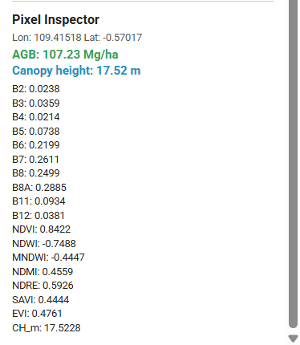
</p>

### Right Panel: Model Performance

Both models are reported in the right panel -- AGB (Stage 2) at the top, CH (Stage 1) below. Each block shows R2, RMSE, MAE, Bias, training info, a scatter plot of observed vs predicted, and a feature importance chart.

<p align="center">
  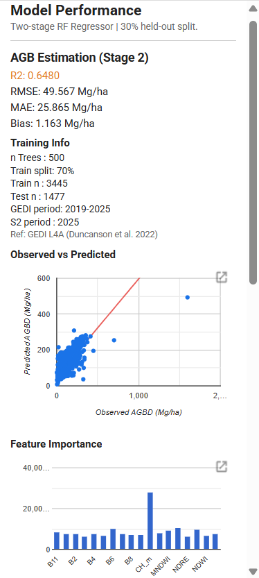
  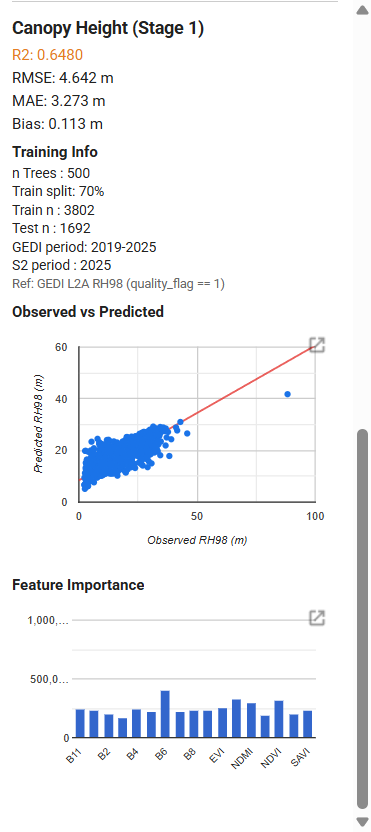
</p>

---

## Data Requirements

| Source | Product | Period | Resolution | Role |
|--------|---------|--------|------------|------|
| Copernicus | Sentinel-2 SR Harmonized | 2025-01-01 to 2025-12-31 | 10 m | Spectral predictors |
| NASA / LARSE | GEDI L2A Monthly | 2019-01-01 to 2025-06-01 | ~25 m footprint | CH training labels |
| NASA / LARSE | GEDI L4A Monthly | 2019-01-01 to 2025-06-01 | ~25 m footprint | AGBD training labels |
| Bunting et al. | Global Mangrove Watch v3 2020 | 2020 | 25 m | Spatial mask |

All datasets are accessed directly via the GEE data catalog. No local downloads are required.

AOI: West Kalimantan Mangrove Coast (south of Pontianak, Kalimantan Barat, Indonesia).

---

## Reproducibility

| Order | Script | Description |
|-------|--------|-------------|
| 1 | `agb_canopy_height_west_kalimantan.js` | Main two-stage CH + AGB estimation |

Run the script in GEE Code Editor with the `aoi` asset imported.

---

## Results

### Output Maps

<p align="center">
  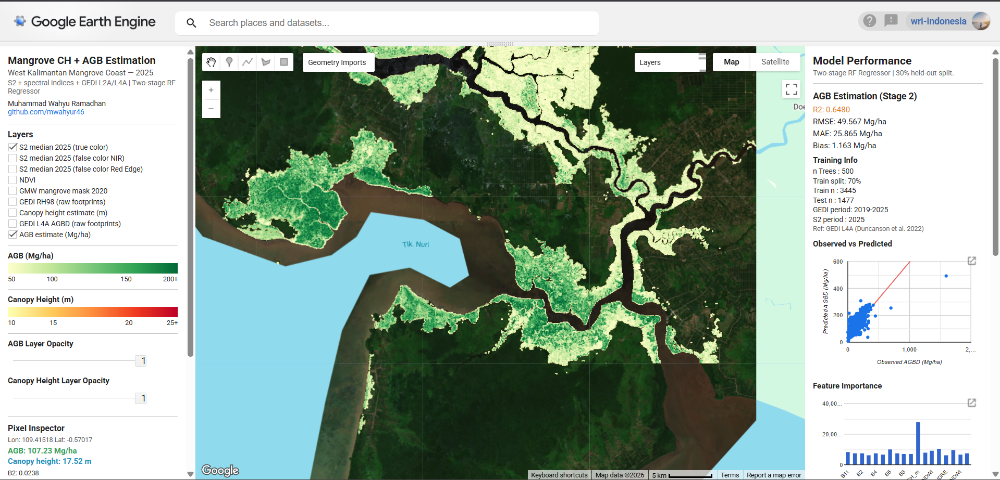
  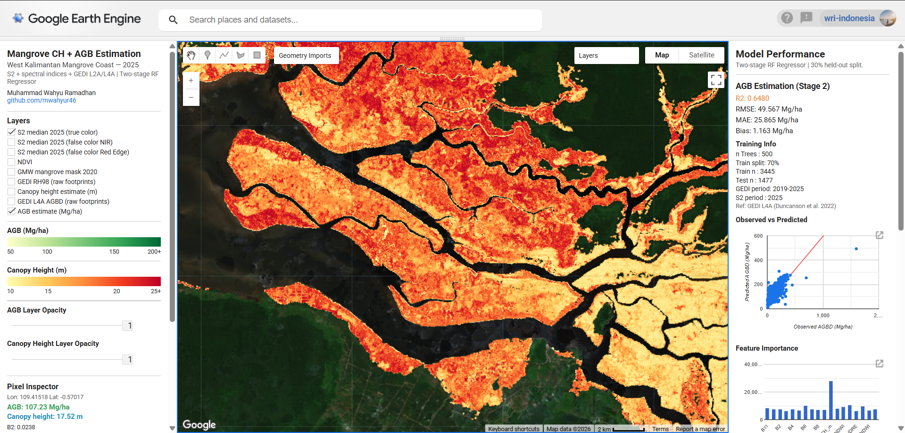
</p>

False color composite (B8A/B11/B4) highlighting mangrove extent:

<p align="center">
  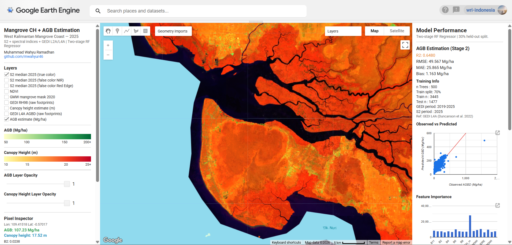
</p>

GEDI footprint distribution within the AOI (diagonal orbit pattern):

<p align="center">
  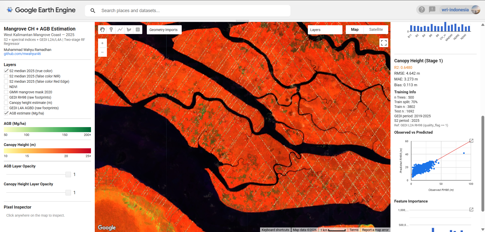
</p>

### Validation Metrics

Results from a representative run. Due to stochastic variation in GEE's RF implementation, R2 values may vary by approximately +/-0.05 across runs under stable server conditions. Larger deviations may occur during periods of high GEE server load.

| Model | R2 | RMSE | MAE | Bias |
|-------|----|------|-----|------|
| Stage 1: Canopy Height (RH98) | 0.6480 | 4.642 m | 3.273 m | 0.113 m |
| Stage 2: AGB (AGBD) | 0.6480 | 49.567 Mg/ha | 25.865 Mg/ha | 1.163 Mg/ha |


### Scatter Plots: Observed vs Predicted

<p align="center">
  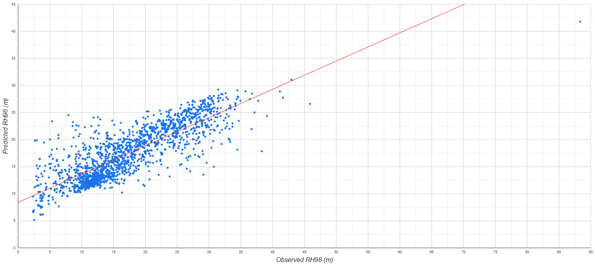
  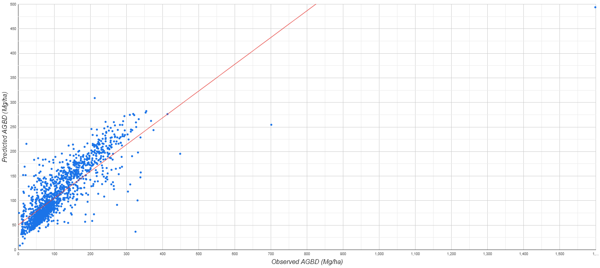
</p>

### Feature Importance

<p align="center">
  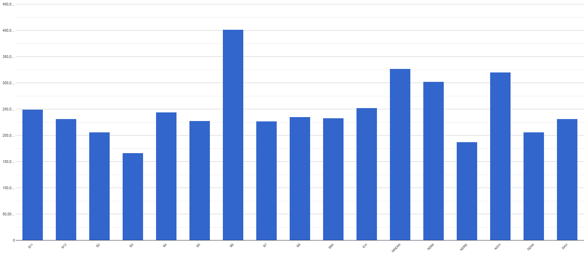
  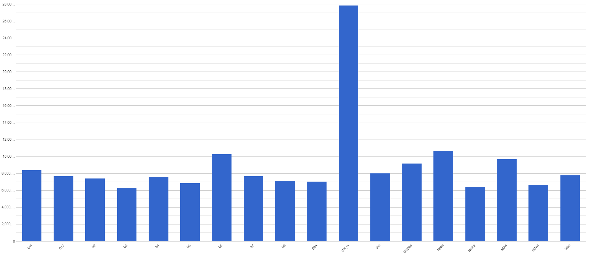
</p>

For the CH model, B6 (red-edge, 740 nm) is the dominant predictor, consistent with its sensitivity to canopy chlorophyll content and vertical structure. For the AGB model, CH_m is the single most important predictor by a large margin, validating the two-stage design. VV and VH SAR backscatter rank highly in both models in the comprehensive version (see Caveats).

### Caveats

- **Model variability.** GEE's `smileRandomForest` does not support a fixed random seed for tree construction. Results may vary across runs. For publication-grade reproducibility, exporting the sample CSV and retraining in Python (scikit-learn with `random_state=42`) is recommended.
- **GEDI footprint sparsity.** GEDI coverage follows a diagonal orbital pattern. Areas between orbit tracks are estimated by the RF model, not directly observed by GEDI. Prediction uncertainty is higher in under-sampled zones.
- **Temporal mismatch.** Sentinel-2 composite uses 2025 imagery; GEDI labels span 2019-2025. Mangrove structural changes over this period are not accounted for.
- **Public vs comprehensive version.** This script uses Sentinel-2 spectral indices as predictors. A comprehensive version incorporating Sentinel-1 SAR (VV/VH), SRTM slope, and additional mangrove-specific indices (CMRI, MVI) yields higher performance (CH R2: ~0.61, AGB R2: ~0.71) at the cost of additional data complexity. Results and UI from the comprehensive version are shown below.

### Enhanced Feature Set

Adding Sentinel-1 SAR (VV/VH), SRTM slope, CMRI, and MVI to the feature stack improves model performance notably for the AGB model. The left panel subtitle reflects the expanded sensor stack ("S2 + S1 + SRTM + GEDI L2A/L4A").

| Model | R2 | RMSE | MAE | Bias |
|-------|----|------|-----|------|
| Stage 1: Canopy Height (RH98) | 0.6119 | 5.024 m | 3.267 m | -0.059 m |
| Stage 2: AGB (AGBD) | 0.7113 | 41.415 Mg/ha | 25.041 Mg/ha | 1.490 Mg/ha |

<p align="center">
  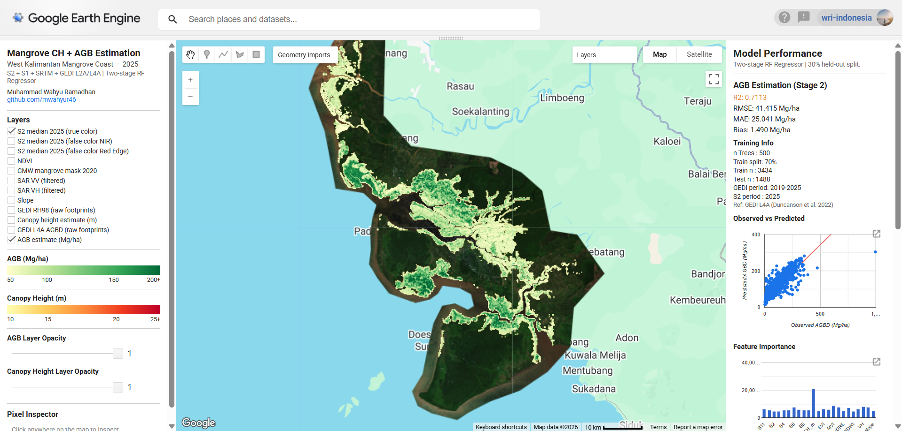
</p>

<p align="center">
  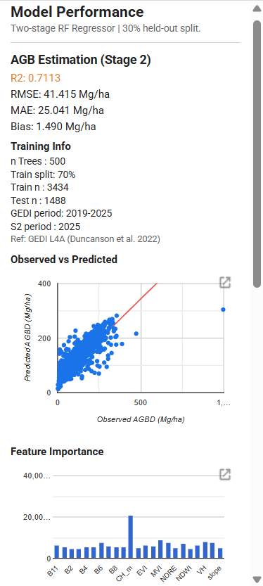
  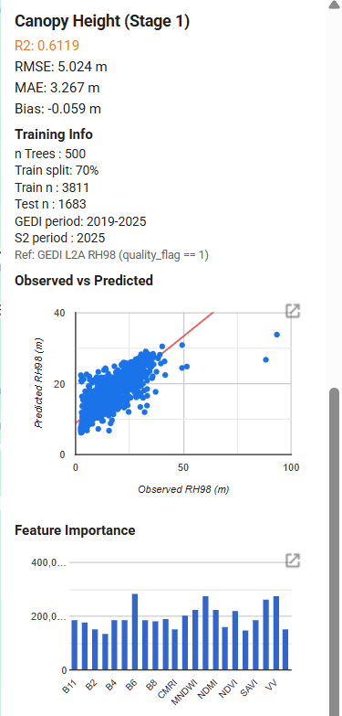
</p>

In the comprehensive version feature importance, **VV** ranks among the top predictors for CH alongside B6, confirming that SAR backscatter captures canopy structural information beyond what optical bands provide. For AGB, **CH_m** remains the dominant predictor, with VH and slope contributing meaningful secondary signal.

---

## Citation

If this work supports your research or project:

> Ramadhan, M. W. (2026). *Mangrove Canopy Height and Above-Ground Biomass Estimation Using Two-Stage Random Forest and GEDI in Google Earth Engine*. GitHub repository. https://github.com/mwahyur46/mangrove-canopy-height-agb-estimation-gee

---

## References

- Duncanson, L., Kellner, J. R., Armston, J., Dubayah, R., Disney, M., Healey, S. P., ... & Hancock, S. (2022). Aboveground biomass density models for NASA's Global Ecosystem Dynamics Investigation (GEDI) lidar mission. Remote Sensing of Environment, 270, 112845. https://doi.org/10.1016/j.rse.2021.112845
- Bunting, P., Rosenqvist, A., Hilarides, L., Lucas, R. M., Thomas, N., Tadono, T., ... & Rebelo, L. M. (2022). Global mangrove extent change 1996-2020: Global Mangrove Watch Version 3.0. Remote Sensing, 14(15), 3657. https://doi.org/10.3390/rs14153657
- Gupta, K., Mukhopadhyay, A., Giri, S., Chanda, A., Majumdar, S. D., Samanta, S., ... & Hazra, S. (2018). An index for discrimination of mangroves from non-mangroves using LANDSAT 8 OLI imagery. MethodsX, 5, 1129-1139. https://doi.org/10.1016/j.mex.2018.09.011
- Baloloy, A. B., Blanco, A. C., Ana, R. R. C. S., & Nadaoka, K. (2020). Development and application of a new mangrove vegetation index (MVI) for rapid and accurate mangrove mapping. ISPRS Journal of Photogrammetry and Remote Sensing, 166, 95-117. https://doi.org/10.1016/j.isprsjprs.2020.06.001
- Main-Knorn, M., Pflug, B., Louis, J., Debaecker, V., Muller-Wilm, U., & Gascon, F. (2017). Sen2Cor for Sentinel-2. Image and Signal Processing for Remote Sensing XXIII, 10427, 37-48. https://doi.org/10.1117/12.2278218

---

## Acknowledgements

This repository is a personal portfolio project developed to demonstrate applied geospatial data science methodology. Academic background: Master of Remote Sensing, Faculty of Geography, Universitas Gadjah Mada.

Datasets are provided by NASA (GEDI), the European Space Agency (Sentinel-2), and the Global Mangrove Watch consortium. Processing was conducted on the Google Earth Engine platform.

---

## Contact

- Muhammad Wahyu Ramadhan
- GitHub: github.com/mwahyur46
- LinkedIn: linkedin.com/in/mwahyur
- Email: mwahyur46@gmail.com
